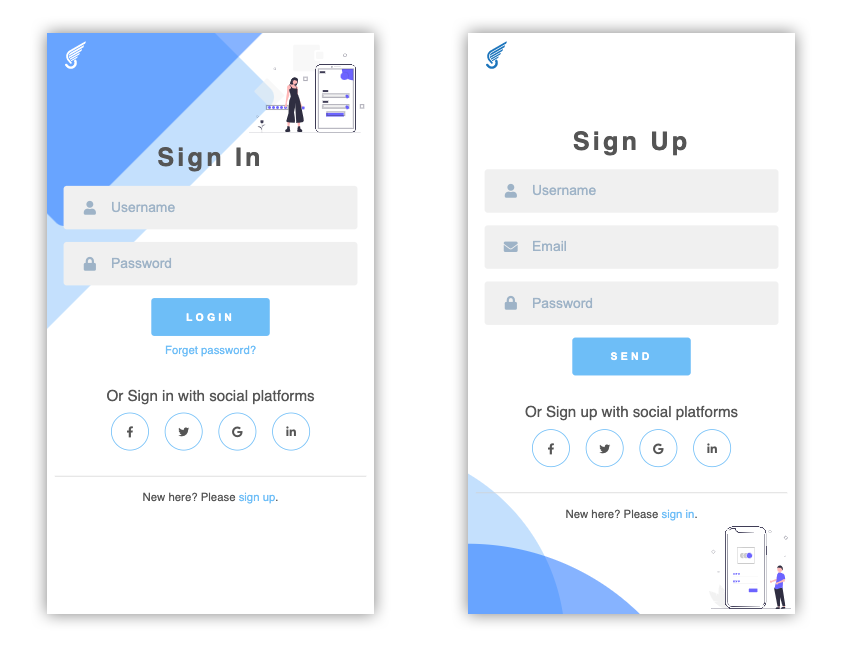

# JavaScript Project_Budget APP

These are sign in and sign up forms that are inspired by <a href="https://github.com/sefyudem/Sliding-Sign-In-Sign-Up-Form">sefyudem</a>. You can click the "sign in" and "sign up" buttons on the webpages to see how the sliding effort works.

Live site: https://jasontwuk.github.io/Sliding-sign-In-and-Sign-Up-Forms/

<h4>Used technologies</h4>
<ul>
  <li>HTML5</li>
  <li>CSS3</li>
  <li>Vanilla JS</li>
  <li><a href="https://github.com/swup/swup">swup.js</a></li>
</ul>

<h4>Used resource</h4>
<ul>
  <li><a href="https://undraw.co/">unDraw</a></li>
</ul>

Here is how it looks like:

